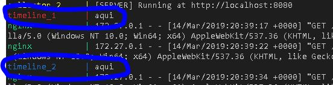

# Desafio Dito - Api's de serviço

As tecnologias usadas para esse projeto.

- Node.js
- Docker/Docker-compose
- Nginx
- MongoDB

## Executando projeto

Para executar o projeto em produção, basta seguir esses passos:

``` sh
git clone https://github.com/fredsonrodrigues/desafio-dito.git
cd desafio-dito
docker-compose up
```
OBS: Certifique-se que o docker esteja instalado e o docker-compose configurado.

### Desenvolvimento: trabalhando com as Api's em específico.

Para desenvolvimento, o passos acimas podem ser seguidos. Mas caso queira mexer com alguma API em específico, faça dessa maneira: 

``` sh
# depois de baixar o projeto..
cd desafio-dito
# vamos por exemplo, trabalhar com a Api de timeline.
cd timeline-events
npm install
npm run dev
```

## Escalando serviços

Para definir quantas réplicas devem ser adicionadas a rede, execute a flag `--scale` junto com o comando `docker-compose`. 

``` sh
docker-compose up -d --scale timeline=2 --scale autocomplete=4 --scale collector=4

# Com esse comando, inicio com duas replicas da api de Timeline, 4 da Api de autocomplete e 4 da api coletora de dados.
```

O serviço será iniciado com os valores definidos no comando. Para encerrar os serviços, basta digitar:

``` sh
docker-compose down
```

Detalhe: Se você alterar a quantidade de réplicas definidas , pode tranquilamente executar o comando `docker-compose up --scale [api]=[quantidade]` novamente. Ele apenas atualizará o número de réplicas sem encerrar o serviço.

Com as réplicas em produção, a própria rede interna trabalhará junto com o nginx para fazer o balanceamento de carga. Segue o exemplo de teste em desenvolvimento: 



Foi colocado um `console.log("aqui")` para que fosse identificado qual das replicas foi chamada no momento.

## Api's do projeto

### Api de autocomplete [event-autocomplete]
A api de autocomplete possui apenas um endpoint, a partir do trecho do nome do evento que o usuário envia, ela retorna e preenche uma caixa de autocomplete no front.

- Endpoint: [GET] `http://<host>/autocomplete-api/search-event/<trecho-do-nome-evento>` 

### Api coletora de dados [event-collector]
A api coletora recebe a partir de um endpointdo tipo POST dados de ações de clientes. 
- Endpoint: [POST] `http://<host>/collector-api/add-event/` 
- Exemplo de dado recebido pela API: 
```json
{
	"event": "nome-do-evento",
	"timestamp": "2016-09-22T13:57:31.2311892-04:00" 
}
```
### Api de Timeline [timeline-events]
A api de timeline recebe dados de compra dos clientes vindos de outro serviço e os organiza de acordo com esse modelo: 
```json
{
    "timeline": [
        {
            "timestamp": "2016-10-02T11:37:31.2300892-03:00",
            "revenue": 120.0,
            "transaction_id": "3409340",
            "store_name": "BH Shopping",
            "products": [
                {
                    "name": "Tenis Preto",
                    "price": 120
                }
            ]
        },
        {
            "timestamp": "2016-09-22T13:57:31.2311892-03:00",
            "revenue": 250.0,
            "transaction_id": "3029384",
            "store_name": "Patio Savassi",
            "products": [
                {
                    "name": "Camisa Azul",
                    "price": 100
                },
                {
                    "name": "Calça Rosa",
                    "price": 150
                }
            ]
        }
    ]
}
```
- Endpoint: [GET] `http://<host>/timeline-api/get-events/`


### NGINX

Todos esses serviços são disponibizados a partir de um container Nginx, que faz a função tanto de load-ballancer como de reverse-proxy. O Nginx tem a porta 8080 para acesso externo.